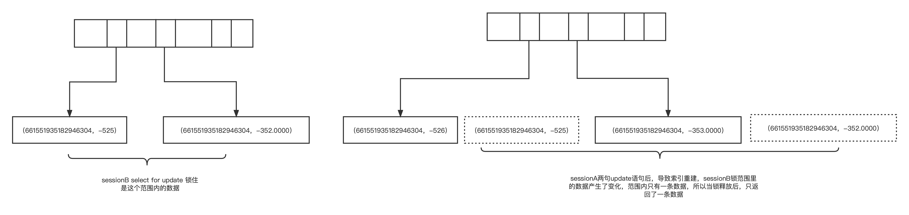

# 1. 事情起因
我们开发的一个应用，在使用按键精灵模拟用户操作的时候，发现库存操作会存在主键
重复插入的情况，实际上该条商品是有库存的，很奇怪。

# 2. 我们想到是不是应用层问题
* 首先我们想到的是MyBatis用法有问题，检查了下MyBatis发现感觉没有问题，但是还是不确定
* 线上我们打开SQL日志，发现SQL是完全正确的，那就更加奇怪了
* 我们想是不是MySQL的问题，内心感觉是不可能的，但是SQL和系统日志表现来看应用层没有问题，不得不怀疑是MySQL的问题，最后发现真是MySQL的问题，其实也不是MySQL的问题，是我们使用的问题，一个索引引起的问题，非常隐蔽

# 3. 发现MySQL的问题
## 在了解这个问题之前首先我们得知道几个知识点
* MySQL 在RC隔离级别下的锁是怎么样的
* select ... for Update的用法
* MySQL索引
* 一条 select 语句 where 条件应用索引的情况下，MySQL 是如何执行的

## 先来重现案发现场
```
CREATE TABLE `mars_core_inventory_level` (
  `inventory_item_id` bigint(20) unsigned NOT NULL,
  `location_id` bigint(20) unsigned NOT NULL ,
  `merchant_id` bigint(20) unsigned NOT NULL ,
  `available` decimal(16,4) NOT NULL ,
  `created_at` datetime NOT NULL ,
  `update_at` datetime NOT NULL ,
  `price` decimal(16,8) DEFAULT NULL ,
  `assist_price` decimal(16,8) DEFAULT NULL ,
  `money` decimal(16,4) DEFAULT NULL ,
  `assist_available` decimal(16,4) DEFAULT NULL,
  PRIMARY KEY (`inventory_item_id`,`location_id`),
  KEY `idx_merchant_id_location_id` (`merchant_id`,`location_id`),
  KEY `idx_merchant_id_inventory_item_id` (`merchant_id`,`inventory_item_id`),
  KEY `idx_merchant_id_available` (`merchant_id`,`available`)
) ENGINE=InnoDB DEFAULT CHARSET=utf8mb4;


INSERT INTO mars_core_inventory_level (inventory_item_id, location_id, merchant_id, available, created_at, update_at, price, assist_price, money, assist_available) VALUES (661552509022453761, 661551935363301376, 661551935182946304, -346.0000, '2022-07-29 10:06:09', '2022-07-29 13:44:50', 0.00000000, 0.00000000, 0.0000, 0.0000);
INSERT INTO mars_core_inventory_level (inventory_item_id, location_id, merchant_id, available, created_at, update_at, price, assist_price, money, assist_available) VALUES (672339754159583233, 661551935363301376, 661551935182946304, -543.0000, '2022-07-29 10:06:09', '2022-07-29 13:44:50', 0.00000000, 0.00000000, 0.0000, 0.0000);

```

<table>
   <tr>
        <th>SessionA</th>
        <th>SessionB</th>

   </tr>
<tr>
<td>

        select * from mars_core_inventory_level where (inventory_item_id = 672339754159583233 and location_id = 661551935363301376) or (inventory_item_id = 661552509022453761 and location_id = 661551935363301376) for update;
        +--------------------+--------------------+--------------------+-----------+---------------------+---------------------+------------+--------------+--------+------------------+
        | inventory_item_id  | location_id        | merchant_id        | available | created_at          | update_at           | price      | assist_price | money  | assist_available |
        +--------------------+--------------------+--------------------+-----------+---------------------+---------------------+------------+--------------+--------+------------------+
        | 672339754159583233 | 661551935363301376 | 661551935182946304 | -552.0000 | 2022-07-29 10:06:09 | 2022-07-29 13:44:50 | 0.00000000 |   0.00000000 | 0.0000 |           0.0000 |
        | 661552509022453761 | 661551935363301376 | 661551935182946304 | -352.0000 | 2022-07-29 10:06:09 | 2022-07-29 13:44:50 | 0.00000000 |   0.00000000 | 0.0000 |           0.0000 |
        +--------------------+--------------------+--------------------+-----------+---------------------+---------------------+------------+--------------+--------+------------------+
</td>
<td>
</td>
</tr>
<tr>
<td></td>
<td>

    select * from mars_core_inventory_level where (inventory_item_id = 672339754159583233 and location_id = 661551935363301376) or (inventory_item_id = 661552509022453761 and location_id = 661551935363301376) for update;

这里锁住里，等待
</td>
<tr>
<td>

    update mars_core_inventory_level set available = -347.0000, update_at = '2022-07-29 13:44:49.673', price = 0, assist_price = 0, money = 0, assist_available = 0 where inventory_item_id = 672339754159583233 and location_id = 661551935363301376 and merchant_id = 661551935182946304;
    update mars_core_inventory_level set available = -544.0000, update_at = ' 2022-07-29 13:44:49.664', price = 0, assist_price = 0, money = 0, assist_available = 0 where inventory_item_id = 661552509022453761 and location_id = 661551935363301376 and merchant_id = 661551935182946304;
    commit;

</td>
<td></td>
</tr>
<tr>
<td></td>
<td>

    锁释放，结果被查询出来，只有一条数据
    +--------------------+--------------------+--------------------+-----------+---------------------+---------------------+------------+--------------+--------+------------------+
    | inventory_item_id  | location_id        | merchant_id        | available | created_at          | update_at           | price      | assist_price | money  | assist_available |
    +--------------------+--------------------+--------------------+-----------+---------------------+---------------------+------------+--------------+--------+------------------+
    | 661552509022453761 | 661551935363301376 | 661551935182946304 | -347.0000 | 2022-07-29 10:06:09 | 2022-07-29 13:44:50 | 0.00000000 |   0.00000000 | 0.0000 |           0.0000 |
    +--------------------+--------------------+--------------------+-----------+---------------------+---------------------+------------+--------------+--------+------------------+
    1 row in set (1.58 sec)

</td>
</tr>
</table>

## 结合知识点分析
### MySQL 在RC隔离级别下的锁是怎么样的？
只有行所，没有gap locks 和next-key locks
### select ... for Update的用法
RC隔离级别下，会将应用索引的行记录进行锁住
### MySQL索引
B+树，分主键索引和普通索引，主键索引叶子节点带有所有信息，普通索引叶子节点只带有主键，where条件中如果应用的是普通索引
### 一条 select 语句 where 条件应用索引的情况下，MySQL 是如何执行的
是先在普通索引树中圈定范围，然后再回表，再将结果按where其他条件进行过滤
## 现在分析上述情况
1. 上面的select语句应用的索引是idx_merchant_id_available，我们画张图分析见

从图中可以看出因为update语句导致select for update 锁范围内的数据产生了变化，大致本应该条件匹配的数据未返回。
2. 我们再次做个实验验证1的想法，我们将sessionA中两句update的available的值都超出sessionB中的锁范围，预期应该是返回一个空数组


第二张图结果来看符合猜想，分析思路基本正确。

## 总结
* 索引字段选择要谨慎，原则上应该选择创建好基本不会变的字段作为索引，经常性变的字段作为索引基本没用，而且因为经常性变导致索引重建，会产生额外的性能问题
* 对于MySQL隔离级别，索引理解不够透彻，需要加强这方面学习
