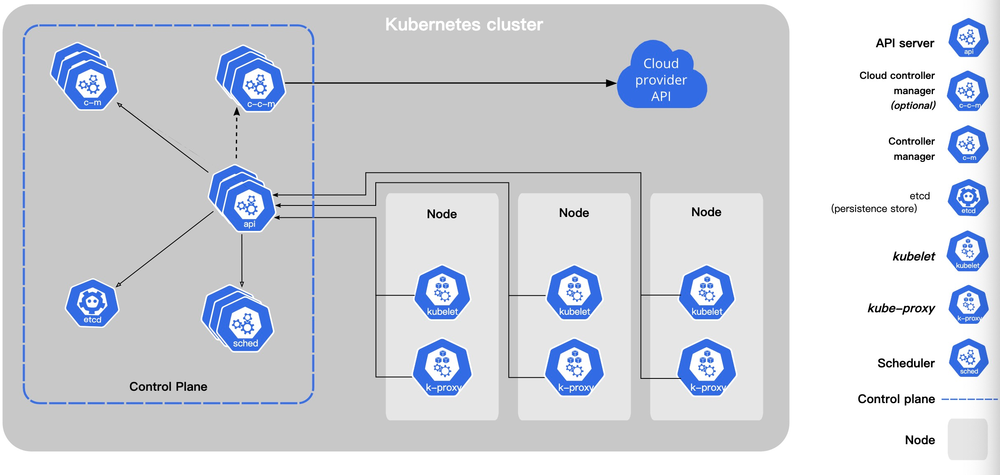

# 架构设计

# 1. Master 节点上的程序

## 1.1 API Server
总体来看，Kubernetes APIServer 的核心功能是提供了 Kubernetes 各类资源对象（如 Pod、RC、Service 等）的增、删、改、查及 Watch 等 HTTPRest 接口，
成为集群内各个功能模块之间数据交互和通信的中心枢纽，是整个系统的数据总线和数据中心。除此之外，它还有以下一些功能特性。

* （1）是集群管理的API入口。
* （2）是资源配额控制的入口。
* （3）提供了完备的集群安全机制。

## 1.2 Controller Manager

Controller Manager 作为集群内部的管理控制中心，负责集群内的 Node、Pod 副本、服务端点（Endpoint）、命名空间（Namespace）、服务账号（ServiceAccount）、资源定额（ResourceQuota）等的管理，
当某个 Node 意外宕机时，Controller Manager 会及时发现此故障并执行自动化修复流程，确保集群始终处于预期的工作状态。

## 1.3 Scheduler

## 1.4 Etcd

# 2. Node 节点的程序

## 2.1 Kubelet

## 2.2 Kube-proxy
