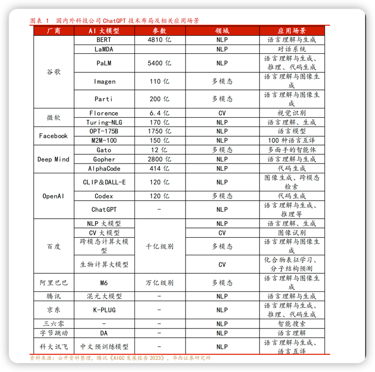

# 几个基本概念

## ChatGPT
**ChatGPT**，全称聊天生成预训练转换器（英语：Chat Generative Pre-trained Transformer[2]），是OpenAI开发的人工智能聊天机器人程序，于2022年11月推出。该程序使用基于GPT-3.5、GPT-4架构的大型语言模型并以强化学习训练。

## 大型语言模型
**大型语言模型**，大型语言模型(LLM)是指包含数千亿（或更多）参数的语言模型，这些参数是在大量文本数据上训练的，例如模型GPT-3、PLM.
Galactica和LLaMA。具体来说，LLM建立在Transformer架构之上，其中多头注意力层堆叠在一个非常深的神经网络中。现有的LLM
主要采用与小语言模型类似的模型架构（即Transformer)和预训练目标（即语言建模）。

## NLP到大型语言模型的进阶历程

五个阶段：规则、统计机器学习、 深度学习、预训练、大型语言模型。

* **规则阶段**大致从1956年到1992年，基于规则的机器翻译系统是在内部把各种功能的模块串到一起，由人先从数据中获取知识，归纳出规则，写出来教给机器，然后机器来执行这套规则，从而完成
特定任务。
* **统计机器学习阶段**大致从1993年到2012年，机器翻译系统可拆成语言模型和翻译模型，这里的语言模型与现在的GPT-3/3.5的技术手段一模一样。该阶段相比上一阶段突变性较高，由人转述知
识变成机器自动从数据中学习知识，主流技术包括SVM、HMM、MaxEnt、CRF、LM等，当时人工标注数据量在百万级左右。
* **深度学习阶段**大致从2013-2018年，相对上一阶段突变性较低，从离散匹配发展到embedding:连续匹配，模型变得更大。该阶段典型技术栈包括Encoder-Decoder、.LSTM、Attention、.
Embedding等，标注数据量提升到千万级。
* **预训练阶段**是从2018年到2022年，相比之前的最大变化是加入自监督学习，张俊林认为这是NLP领域最杰出的贡献，将可利用数据从标注数据拓展到了非标注数据。该阶段系统可分为预训练和
微调两个阶段，将预训练数据量扩大3到5倍，典型技术栈包括Encoder--Decoder、.Transformer、.Attention等。
* **大型语言模型阶段**从2023年起，目的是让机器能听懂人的命令、遵循人的价值观。其特性是在第一个阶段把过去的两个阶段缩成一个预训练阶段，第二阶段转换成与人的价值观对齐，而不是向领
域迁移。这个阶段的突变性是很高的，已经从专用任务转向通用任务，或是以自然语言人机接口的方式呈现。

## 大型语言模型的涌现能力
LLM的三种代表性的涌现能力：
* **上下文学习**。GPT-3正式引入了上下文学习能力：假设语言模型已经提供了自然语言指令和多个任务描述，它可以通过完成输入文本的词序列来生成测试实例的预期输出，而无需额外的训练或
  梯度更新。
* **指令遵循**。通过对自然语言描述（即指令）格式化的多任务数据集的混合进行微调，LLM在微小的任务上表现良好，这些任务也以指令的形式所描述。这种能力下，指令调优使LLM能够在不使
  用显式样本的情况下通过理解任务指令来执行新任务，这可以大大提高泛化能力。
* **循序渐进的推理**。对于小语言模型，通常很难解决涉及多个推理步骤的复杂任务，例如数学学科单词问题。同时，通过思维链推理策略，LLM可以通过利用涉及中间推理步骤的pOt机制来解
  决此类任务得出最终答案。据推测，这种能力可能是通过代码训练获得的。

## 大型语言模型的关键技术
LLMs的关键技术，包括了缩放、训练、能力激发、对齐调优、工具利用等。
* **缩放**。缩放是增加LLMs模型容量的关键因素，最开始GPT-3将模型参数增至1750亿，随后PLM进一步将模型参数增至5400亿。大规模参数对于涌现能力至关重要。缩放不仅针对模型大
  小，还与数据大小和总计算量有关。
* **训练**。由于规模巨大，成功训练一个具备强大能力的LLMs非常具有挑战性。因此需要分布式训练算法来学习LLMs的网络参数，经常联合使用各种并行策略。为了支持分布式训练，
  DeepSpeed和Megatron--LM等优化框架被用来促进并行算法的实现和部署。此外，优化技巧对训练稳定性和模型性能也很重要，例如重新启动训练损失尖峰和混合精度训练。最近的GPT-4开发
  了特殊的基础设施和优化方法，从而利用小得多的模型来预测大模型的性能。
* **能力激发**。在大规模语料库上经过预训练后，LLMs被赋予了解决一般任务的潜在能力。然而当LLMs执行某个特定任务时，这些能力可能不会显式地表现出来。因此设计适合的任务指令或特定
  的上下文策略来激发这些能力非常有用，比如思维链prot有助于通过中间推理步骤等解决复杂推理任务。此外还可以进一步对具有自然语言任务描述的LLMs进行指令调优，以提高对未见过任务
  的泛化能力。
* **对齐调优**。由于LLMs被训练用来捕获预训练语料库的数据特征（包括高质量和低质量的数据），它们很可能生成对有毒、有偏见和有害的文本内容。为了使LLMs与人类价值观保持一致，
  InstructGPT设计了一种利用强化学习和人类反馈的高效调优方法，使得LLMs能够遵循预期指令。ChatGPT是在类似InstructGPT的技术上开发的，在产生高质量、无害的响应方面表现出了强大
  的对齐能力。
* **工具利用**。LLMs本质上是基于大规模纯文本语料库训练的文本生成器，因此在数值计算等文本表达不佳的任务上表现没那么好。此外LLMs的能力受限于预训练数据，无法捕获最新信息。针对
  这些问题，人们提出使用外部工具来弥补LLMs的不足，比如可以利用计算器进行精确计算，使用搜索引擎检索未知信息。ChatGPT更是利用外部插件来联网学习新知识，这种机制可以广泛扩展
  LLMs的能力范围。

### ChatGPT的四个关键技术

1. 大规模预训练模型：只有模型规模足够大，才可能具备推理能力。中国人民大学高瓴人工智能学院长聘副教授严睿谈道，智能涌现不是故意设计出来的，而是大模型规模大到一定程度后，天“
具备这样的特性
2. 在代码上进行预训练：可能代码把解决一个大的问题分解成若干个小的问题，这种分布解决问题的方式有助于自然语言推理。和自然语言模型相比，代码语言模型需要更长的上下文的依赖。
3. Prompt/,Instruction Tuning:GPT-3模型太大，已经没办法去精调了，只能用prompt,,但是如果不精调，模型相当于还是一个语言模型，没办法适应人，只能由人去适应模型。让人适应模
型只能用指令的方式，再进行精调，这相比预训练代价要小的多。所以指令上精调就可以把一些不太多的数据，把语言模型的任务掰到适应人类的回答问题
4. 基于人类反馈的强化学习(RLHF)：这对于结果好坏的影响不是特别大，甚至会限制语言模型生成的能力，但这种方式可能更好地和人类在安全性、无毒无害等等方面的价值观对齐。当模型
上线后，它可以收集到更多用户的反馈。

## 大型语言模型的三大技术路线
1. Bert模式有两阶段（双向语言模型预训练+任务Fine-tuning)，适用于理解类、做理解类、某个场景的具体任务，专而轻。
2. GPT模式是由两阶段到一阶段（单向语言模型预训练+zero shot prompt/,Instruct)，比较适合生成类任务、多任务，重而通。
3. T5模式将两者的方法结合，有两阶段（单向语言模型预训练+Fie-tuning)。张俊林称这种模式“形似GPT，,神似Bert”,生成和理解都行，从效果上看较适合理解类任务，国内很多大型语言模型

# 大型语言模型在客户联络领域的应用价值

1. 提升自动回复能力

   大模型的工作逻辑始于对大量数据的持续训练。充分、持续的训练，能够使大模型具备更加精准的语义理解能力和更强大的自然语言生成能力。
   基于已经训练成熟的大模型，智能客服系统的开发就有了更加坚实的底层支撑。它可以根据用户输入的问题提供快速和准确的响应，快速解决问题，节省了客服团队大量的时间和资源，提高客户
   体验和满意度。

2. 强化意图识别能力

   智能客服能否处理复杂问题，在行业内有一个通用的指标，就是意图识别的准确率。
   观察客户联络领域所处的现状，大部分是把简单、重复、流程性的问题，交给机器人处理；复杂的、需要情感关怀的问题，则交由人工客服处理。而传统的智能客服在意图理解方面的能力，仍然
   相对薄弱。
   ChatGPT的泛化为我们提供了处理复杂问题的新思路。
   基于对文本、语音、图像等多模态数据的分析，大模型对于意图识别的准确性进一步提升。借助大模型，智能客服能够有效结合用户的历史对话、当前沟通内容等上下文语境，更精准地识别出用
   户的需求和意图。同时，借助大模型所具备的深度学习能力，进行更加智能化的问答推荐，进而有效赋能企业的业务咨询、留资引导、服务应答等环节。

3. 优化人机交互体验

   传统机器人在处理复杂场景的时候，往往应变能力不够灵活。一旦用户问的问题在知识库里没有，或者超出了预设的流程，机器人就无法很好地应对了。但是，基于大模型超强的知识库，上述情
   况就缓解了很多。
   以ChatGPT为例来看，大模型的深度应用也开创了客户使用体验的新范本。其丰富的参数和强大的内容生成能力，能够支持智能客服实现更加个性化的问答回复，而非过往千篇一律的机械式问
   答。

4. 丰富实际应用场景

   基于大模型所提供的底层能力，智能客服的渗透力和应用场景也将在未来得到进一步延伸。
   ChatGPTI的应用目前已经有相对确定的场景可以落地了，如扮演人工客服与客户沟通专业知识、提供专业的问答知识建议、对沟通记录进行质检标记、主动分析座席工作行为、发起产品推介、闲
   聊寒暄以及更“人性化”的引导留资等。

# ChatGPT，巨头都在干什么

## 国内外科技公司 ChatGPT 技术布局及相关应用场景

## AIGC

AIGC 有望成为继 UGC、PGC/OGC 之后的新型内容生产，原因是其符合内容生态建
设的三大关键要素:
1. 内容数量: 内容数量明显增多，边际制作成本大幅下降，内容多样性有望提高，例如阅文集团2021年新增平台字数360亿+，而根据新浪科技消息，2021年GPT- 3，日产出已经达到 45 亿词。
2. 内容质量: 内容质量有望提高，原因是人工智能模型可从大量数据中学习，且信息准确，例如 DALL·E 的效果已经接近中等画师的水平。
3. 客户交互: AIGC 更具备“拟人化”的能力，客户的交互效果有望大幅提升，同时叠加平台自身的客户交互属性，用户粘性有望提升

## 三类 AIGC 厂商
1. 具备算力基础的厂商；
2. AI 商业算法商业落地的厂商；
3. AIGC 相关技术储备的应用厂商。

# 参考文档
[1] https://wiki.mbalib.com/wiki/%E5%A4%A7%E5%9E%8B%E8%AF%AD%E8%A8%80%E6%A8%A1%E5%9E%8B

[2] https://zh.wikipedia.org/wiki/ChatGPT

[3] [ChartGPT 巨头们都在干什么](../assets/img/nhsoft_lsd/ChartGPT1.pdf)

[4] [ChartGPT 成功连接 未来可期](../assets/img/nhsoft_lsd/chartgpt2.pdf)
