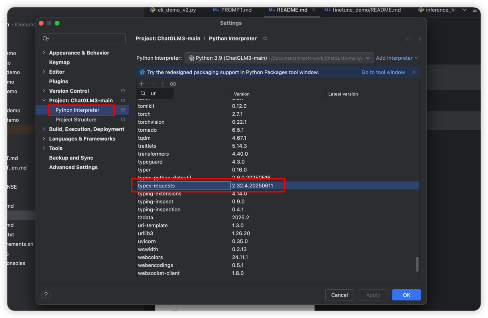

# 环境准备
1. Python 3.9.6
2. MacBook Pro M1 32G
3. Pycharm

**注意**
```
对于搭载了 Apple Silicon 或者 AMD GPU 的 Mac，可以使用 MPS 后端来在 GPU 上运行 ChatGLM3-6B。需要参考 Apple 的 官方说明(https://developer.apple.com/metal/pytorch/) 安装 PyTorch-Nightly（正确的版本号应该是2.x.x.dev2023xxxx，而不是 2.x.x）。
```

# 下载模型
```
git clone https://github.com/THUDM/ChatGLM3
cd ChatGLM3
```
注意：官网下载（注意 hf 官方下载文件不全，使用时会报错）

国内镜像下载
```
git clone https://www.modelscope.cn/ZhipuAI/chatglm3-6b.git
```

# 安装依赖
```
pip install -r requirements.txt -i https://pypi.tuna.tsinghua.edu.cn/simple --verbose
```

# 期间遇到的几个问题：
一
```
ERROR: Could not find a version that satisfies the requirement torch==2.5.1 (from versions: 2.6.0, 2.7.0, 2.7.1)
ERROR: No matching distribution found for torch==2.5.1
```
Python选择的是3.13. 降低版到 3.9

二
```
: NotOpenSSLWarning: urllib3 v2 only supports OpenSSL 1.1.1+, currently the 'ssl' module is compiled with 'LibreSSL 2.8.3'.
```
Pycharm urlib3 从 2.x 降低到 1.26.20


三

```
web_demo_gradio.py 缺少 peft 依赖，如果不指定版本，会报以下错误：
ImportError: cannot import name 'EncoderDecoderCache' from 'transformers' (/Users/lusudong/Documents/nhsoft-work/ChatGLM3-main/venv/lib/python3.9/site-packages/transformers/__init__.py)
```
改为  pip install peft==0.13.2 进行下载依赖

四
```
Internal: could not parse ModelProto from /Users/lusudong/Documents/ai-models/chatglm3-6b/tokenizer.model
```
hf 官方下载文件不全，改为从 modelscope 下载
