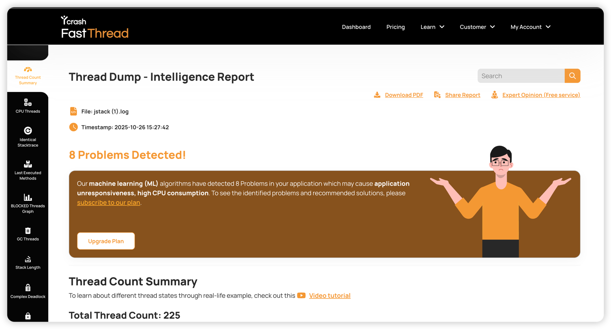
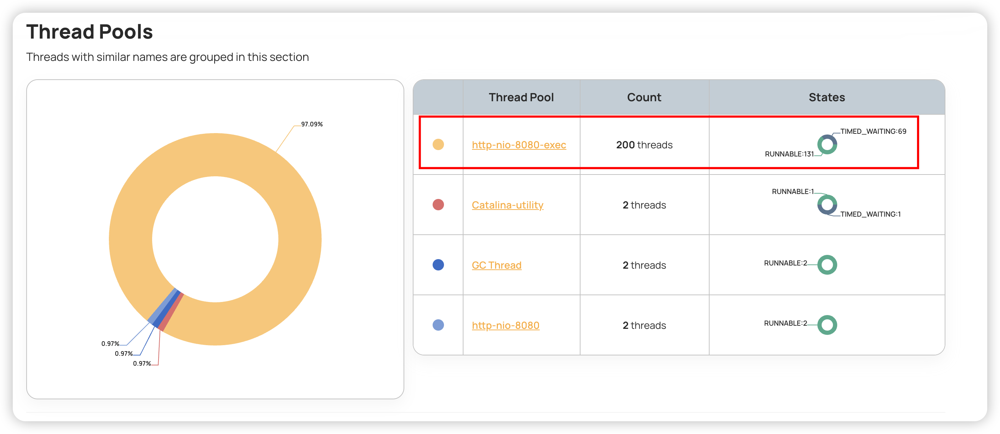
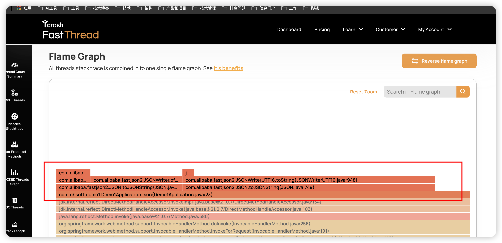

# 一、基本信息和工具
- 服务器配置 阿里云上ECS服务器，配置为*2核4G*为例
- 压测工具 `wrk`, 下载见 [wrk 下载和安装.md](wrk%20%E4%B8%8B%E8%BD%BD%E5%92%8C%E5%AE%89%E8%A3%85.md)
- 压测脚本 `wrk -t 2 -c 500 -d 60s --latency http://localhost:8080/json?count=1000`
- Java 核心代码，用于压测，来观测CPU负载
```java
@GetMapping("/json")
    public String json(@RequestParam(value = "count", defaultValue = "1") int count) {

        for (int i = 0; i < count; i++) {
            String json = JSON.toJSONString(new Person("张三", 20, "北京"));
            JSON.toJavaObject(json, Person.class);
            if (i == 100000) {
               //方面抓线程日志
                try {
                    Thread.sleep(1000 * 10);
                } catch (InterruptedException e) {
                    throw new RuntimeException(e);
                }
            }
        }
        return "ok";
    }

    public static class Person {
        private final String name;
        private final int age;
        private final String address;

        public Person(final String name, final int age, final String address) {
            this.name = name;
            this.age = age;
            this.address = address;
        }

        public String getName() {
            return name;
        }

        public int getAge() {
            return age;
        }

        public String getAddress() {
            return address;
        }
    }
```
- 在线线程分析工具 `https://fastthread.io/`

# 查看CPU信息

首先需要查看当前CPU 配置，架构，命令 `lscpu`

```
Architecture:        x86_64  # 架构 指 CPU 的指令集架构，x86_64 表示 64 位 x86 架构，是目前主流的 PC 和服务器架构
CPU op-mode(s):      32-bit, 64-bit # CPU 操作模式 32-bit, 64-bit 表示 CPU 同时支持 32 位和 64 位操作系统及应用程序
Byte Order:          Little Endian # 字节序 Little Endian（小端序），指多字节数据在内存中低字节存低地址、高字节存高地址的存储方式，是 x86 架构的默认方式
CPU(s):              2 # CPU 总数 2 表示当前系统识别到的逻辑 CPU 数量为 2
On-line CPU(s) list: 0,1 # 0,1 表示编号为 0 和 1 的两个 CPU 处于正常工作状态
Thread(s) per core:  2 # 每核心线程数 2 表示每个物理核心支持 2 个线程，即开启了超线程技术
Core(s) per socket:  1 # 每插槽核心数 1 表示每个 CPU 插槽上的物理核心数量为 1
Socket(s):           1 #  插槽数 1 表示主板上有 1 个 CPU 插槽，且已安装 1 个 CPU
NUMA node(s):        1 # NUMA 节点数 1 表示系统只有 1 个 NUMA 节点，NUMA（非统一内存访问）是多 CPU 架构中优化内存访问的技术，单节点意味着内存访问延迟一致
Vendor ID:           GenuineIntel # 厂商 ID
BIOS Vendor ID:      Alibaba Cloud # BIOS 厂商 ID
CPU family:          6 # CPU 系列
Model:               85 # 型号编号 	85 是英特尔内部用于区分同系列下不同具体型号的标识，对应特定的硬件规格
Model name:          Intel(R) Xeon(R) Platinum # 型号名称	Intel (R) Xeon (R) Platinum 表示 CPU 具体型号为英特尔至强铂金系列，属于英特尔面向高端服务器的旗舰级 CPU 系列
BIOS Model name:     pc-i440fx-2.1 # BIOS 型号名称
Stepping:            4 # 步进	4 表示 CPU 的生产步进版本，步进更新通常用于修复硬件漏洞、优化稳定性，数字越大版本越新
CPU MHz:             2500.002 # CPU 主频 2500.002 MHz（约 2.5GHz），指 CPU 核心的基础运行频率，直接影响 CPU 的基础运算速度
BogoMIPS:            5000.00 # BIOS 型号名称
Hypervisor vendor:   KVM
Virtualization type: full # full（全虚拟化）表示虚拟机可完全模拟物理硬件，支持运行未经修改的操作系统，兼容性更强
L1d cache:           32K # 一级数据缓存 32K 表示每个核心的一级数据缓存容量为 32KB，用于临时存储 CPU 即将处理的数据，速度极快
L1i cache:           32K # 一级指令缓存 32K 表示每个核心的一级指令缓存容量为 32KB，用于临时存储 CPU 即将执行的指令，与 L1d 缓存分工协作
L2 cache:            1024K # 二级缓存	1024K（即 1MB）表示每个核心的二级缓存容量为 1MB，速度介于 L1 缓存和 L3 缓存之间，用于缓解 L1 缓存容量不足的问题
L3 cache:            33792K # 三级缓存 33792K（约 33MB）表示整个 CPU 的共享三级缓存容量为 33MB，由所有核心共享使用，用于减少 CPU 对内存的访问依赖
NUMA node0 CPU(s):   0,1
```

# 查看CPU负载
命令 `uptime`
```
[root@iZm5eir5ome0diow93n29fZ ~]# uptime
 14:32:53 up  1:09,  3 users,  load average: 2.49, 1.26, 0.61
```

命令 `top`
```
top - 14:34:18 up  1:10,  3 users,  load average: 2.41, 1.52, 0.76
Tasks: 111 total,   1 running, 110 sleeping,   0 stopped,   0 zombie
%Cpu(s): 39.3 us, 15.7 sy,  0.0 ni, 31.4 id, 11.9 wa,  1.2 hi,  0.5 si,  0.0 st
MiB Mem :   3563.5 total,     99.7 free,    866.2 used,   2874.1 buff/cache
MiB Swap:      0.0 total,      0.0 free,      0.0 used.   2697.3 avail Mem

  PID USER      PR  NI    VIRT    RES    SHR S  %CPU  %MEM     TIME+ COMMAND
31543 root      20   0 3945760 362552  26768 S 106.6   9.9   2:19.08 java
31897 root      20   0       0      0      0 I   1.0   0.0   0:00.19 kworker
```
重点看以下字段：
- %us：用户态 CPU 使用率（代码计算）
- %sy：内核态 CPU 使用率（系统调用）
- %id：空闲
- %wa：IO 等待
- %st：虚拟化环境下被“偷走”的 CPU 时间

👉 如果 %us 很高 → 应用计算密集
👉 如果 %sy 很高 → 系统调用频繁（网络/磁盘/锁）
👉 如果 %wa 高 → IO 瓶颈
👉 如果 %st 高 → 宿主机 CPU 紧张

命令 `top -c`
```
top - 14:44:55 up  1:21,  3 users,  load average: 0.15, 0.21, 0.38
Tasks: 105 total,   2 running, 103 sleeping,   0 stopped,   0 zombie
%Cpu(s): 38.6 us, 16.6 sy,  0.0 ni, 43.1 id,  0.0 wa,  1.2 hi,  0.5 si,  0.0 st
MiB Mem :   3563.5 total,    130.3 free,    859.0 used,   2848.5 buff/cache
MiB Swap:      0.0 total,      0.0 free,      0.0 used.   2704.4 avail Mem

    PID USER      PR  NI    VIRT    RES    SHR S  %CPU  %MEM     TIME+ COMMAND
31543 root      20   0 3945760 367800  26828 S 109.0  10.1   2:47.44 java -jar demo1.jar
```

可以看到具体哪个线程（TID）CPU 占用高。 `top -Hp <PID>`

转换为 16 进制线程号 `printf "%x\n" <TID> `

确认线程栈调用日志 `jstack <PID> | grep -A 30 89c5 `, 89c5 是线程号，换成 16 进制的线程号。

打印全部线程日志 `jstack <PID> > jstack.log`

# 分析日志有两种方式
## 1、FastThread
将 jstack.log 上传到 fastthread 网站，分析结果如下：




# 2、ChatGPT 等大数据模型进行分析
结果如下，可以发现大模型分析和定位的结果还是蛮正确的

---

### 🧠 一、总体情况

这是一个 **Tomcat + Spring Boot 应用的线程快照**。从线程状态看：

* 没有死锁（没有 "Found one Java-level deadlock" 提示）。
* 大部分系统线程（GC、Finalizer、Compiler 等）状态正常。
* **CPU 高负载主要集中在若干个业务执行线程 (`http-nio-8080-exec-*`) 上。**

---

### ⚙️ 二、关键问题线程分析

在日志中，多个线程（exec-1 到 exec-9）处于 **RUNNABLE** 状态，且调用栈几乎一致：

```
at com.alibaba.fastjson2.JSON.toJavaObject(JSON.java:1273)
at com.nhsoft.demo1.Demo1Application.json(Demo1Application.java:24)
```

或：

```
at com.alibaba.fastjson2.JSONWriterUTF16.toString(JSONWriterUTF16.java:948)
at com.alibaba.fastjson2.JSON.toJSONString(JSON.java:749)
at com.nhsoft.demo1.Demo1Application.json(Demo1Application.java:23)
```

这些线程都在执行 `Demo1Application.json()` 方法，里面在使用 **fastjson2 进行 JSON 序列化/反序列化**。

---

### 📈 三、CPU 高负载原因推测

**1️⃣ JSON 处理 CPU 开销大**

* fastjson2 的 `JSONReaderStr.readString()`、`ObjectReaderNoneDefaultConstructor.readObject()`、
  `TypeUtils.cast()`、`String.substring()` 等调用频繁出现。
* 说明请求体或响应体 JSON 较大、结构复杂，反复创建新对象、字符串复制，导致 **CPU 占用高**。
* 所有 `http-nio-8080-exec-*` 都在做 JSON 序列化/反序列化，说明请求压测或循环调用该接口。

**2️⃣ 多线程并行 JSON 转换**

* Tomcat 默认线程池会同时处理多个请求，这里有多个 `exec-*` 线程都在 `RUNNABLE`。
* 若 JSON 操作 CPU 密集，会导致所有 worker 都占满 CPU，表现为 **CPU 负载高**。

**3️⃣ 没有阻塞或死锁**

* 没有 WAITING、BLOCKED 的长时间线程。
* 所以这是 **CPU 计算过载**，不是线程互锁问题。

---

### 🧩 四、定位具体高占用代码

从堆栈看：

```java
com.nhsoft.demo1.Demo1Application.json(Demo1Application.java:23-24)
```

该方法大概率类似如下逻辑：

```java
public Object json(String str) {
    Object obj = JSON.toJavaObject(JSON.parseObject(str), SomeClass.class); // 反序列化
    return JSON.toJSONString(obj); // 再序列化
}
```

这会导致：

* **对象重复解析和生成 JSON 字符串**
* 在循环或高并发下 CPU 飙升

---

### 🧰 五、优化建议

#### ✅ 1. 减少 JSON 转换

* 若只是透传数据，避免重复 `JSON.toJavaObject()` → `toJSONString()`。
* 考虑直接返回 JSON 字符串或使用 `@ResponseBody` 自动序列化。

#### ✅ 2. 优化 fastjson2 使用

* fastjson2 默认使用反射构造对象，频繁创建 `ConstructorFunction` 实例。
* 可：

  * 缓存解析器 (`JSONReader`/`JSONWriter`)
  * 使用 `JSON.parseObject(str, clazz, JSONReader.Feature.SupportAutoType)` 提升性能。

#### ✅ 3. 压测和线程数控制

* 限制 Tomcat `maxThreads`，防止同时大量 CPU 密集任务。
* 使用异步队列或线程池分流非实时 JSON 任务。

#### ✅ 4. 如果仍高

* 可通过 `jstack` + `top -Hp` 对比线程 ID（nid）找到最耗 CPU 的线程栈。
* 若仍在 fastjson2 内部循环，应检查是否有大 JSON、无限递归结构等问题。

---

### 🧾 六、结论总结

| 问题类型    | 结论                               |
| ------- | -------------------------------- |
| CPU 高占用 | ✅ 由多线程同时执行 JSON 序列化/反序列化引起       |
| 死锁      | ❌ 无死锁                            |
| 阻塞      | ❌ 无明显阻塞线程                        |
| 优化方向    | 减少 JSON 转换、优化 fastjson2 使用、降低并发度 |

---


